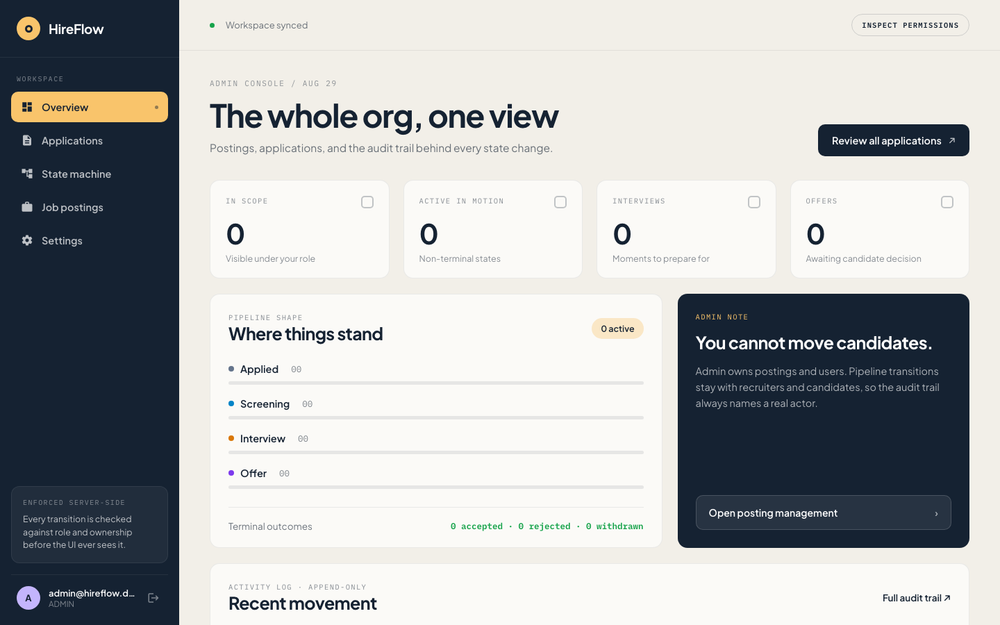
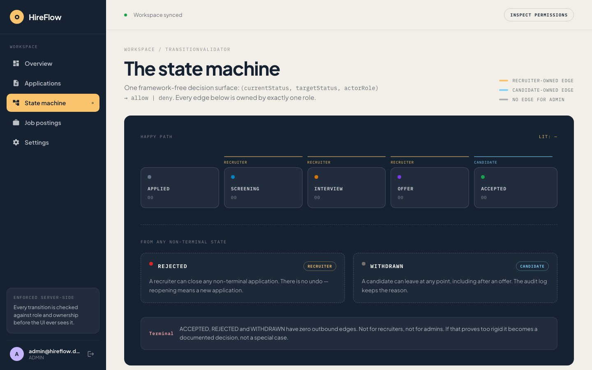
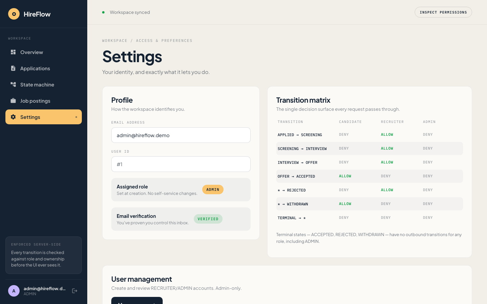
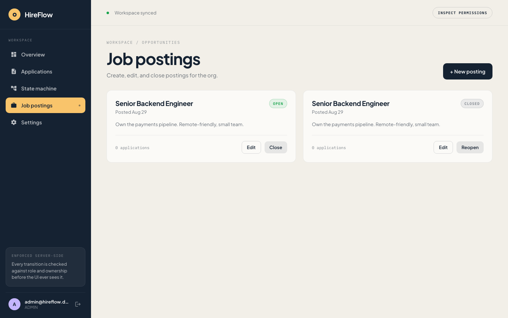

# HireFlow


**Live demo**: [hireflow-frontend-zg69.onrender.com](https://hireflow-frontend-zg69.onrender.com)
(backend: [hireflow-backend-c3mv.onrender.com](https://hireflow-backend-c3mv.onrender.com)), free
tiers throughout (Render + Neon). The backend spins down after 15 minutes idle, so the first
request after a while can take 30-50s to wake it up. Log in as `admin@hireflow.demo` /
`DemoAdmin2026!` for the ADMIN view, or register a new account for the CANDIDATE flow.



A role-aware recruiting pipeline: candidates apply, recruiters move applications through a
strictly-enforced state machine, admins manage postings, and every status change is written to an
append-only audit log. Built to exercise real Spring Security (JWT + method-level `@PreAuthorize`,
ownership checks, refresh-token rotation) and a genuinely tested state machine, not another CRUD
demo.

## Tech stack

**Backend**: Java 21, Spring Boot 3.5 (Web, Data JPA, Security, Validation), PostgreSQL
(Testcontainers for tests), JWT via `jjwt`, BCrypt, JUnit 5 + Spring Security Test, Maven, Lombok.

**Frontend**: Angular 18+, standalone components (no NgModules), functional route guards +
`HttpInterceptorFn`, RxJS for token-refresh coordination, no state-management library. A custom
design system ("ApplyTrack": cream/ink-navy/amber, Plus Jakarta Sans + IBM Plex Mono) sits on top
of Angular Material's form controls, restyled via global overrides. Karma/Jasmine for unit tests.

## Project layout

```
com.hireflow
├── user           entity/repository/dto for User + Role
├── auth           register/login/refresh, RefreshToken/PasswordResetToken/EmailVerificationToken
├── posting        JobPosting: controller, service, repository, DTOs
├── application
│   ├── transition   TransitionValidator + TransitionResult + ApplicationStatus (framework-free)
│   ├── entity        Application, ApplicationEvent (audit log)
│   ├── controller/service/repository/dto
├── admin          admin-only user management + bootstrap
├── security        JWT filter/service, SecurityConfig, CustomUserDetails
└── common          GlobalExceptionHandler, ApiError, domain exceptions
```

## The state machine

```
APPLIED → SCREENING → INTERVIEW → OFFER → ACCEPTED   (forward: RECRUITER only, one step at a time)
                                        ↘ REJECTED     (from any non-terminal state: RECRUITER only)
   WITHDRAWN   (from any non-terminal state: CANDIDATE only, owner only)
   ACCEPTED    (from OFFER only: CANDIDATE only, owner only)

Terminal states: ACCEPTED, REJECTED, WITHDRAWN. No transitions out, ever, for anyone, including ADMIN.
```



`TransitionValidator` (`com.hireflow.application.transition`) is a plain Java class with no
Spring/JPA imports: a pure function `(currentStatus, targetStatus, actorRole) -> TransitionResult`.
It's the most heavily tested piece of the project:

- `TransitionValidatorExhaustiveTest`: all **147** combinations of 7 statuses × 7 statuses × 3
  roles, checked against a hand-written table of the 12 legal transitions written independently of
  the implementation, so the test can't become a tautology.
- `TransitionValidatorPositiveTest` / `TransitionValidatorNegativeTest`: one explicit test per
  legal transition, plus wrong role, wrong starting state, skipped steps, terminal states, and null
  inputs.

`PATCH /api/applications/{id}/status` asks the validator whether a specific
`(currentStatus, targetStatus, role)` triple is legal. A denial, for any reason, is **400 Bad
Request** with the validator's own reason string. Ownership violations (acting on *someone else's*
application) are checked separately and return **403 Forbidden**. Every other role-gated endpoint
uses `@PreAuthorize` directly.

## API summary

| Method | Path | Access | Notes |
|---|---|---|---|
| POST | `/api/auth/register` | public | Always forces `CANDIDATE`, regardless of what the client sends |
| POST | `/api/auth/login` | public | Returns `{ accessToken, refreshToken }` |
| POST | `/api/auth/refresh` | public | Rotates the refresh token; the old one is immediately revoked |
| POST | `/api/auth/password-reset/{request,confirm}` | public | Dev-mode token in the response, see below |
| POST | `/api/auth/email-verification/{request,confirm}` | public | Same dev-mode tradeoff |
| GET | `/api/postings` | authenticated | ADMIN sees OPEN + CLOSED; everyone else sees OPEN only |
| POST/PATCH | `/api/postings` | ADMIN | Create / partial update |
| POST | `/api/applications` | CANDIDATE | Apply; unique per (candidate, posting); 409 on duplicate or closed posting |
| GET | `/api/applications/mine` | CANDIDATE | Own applications only |
| GET | `/api/applications` | RECRUITER, ADMIN | All applications; filter with `?postingId=`/`?status=` |
| PATCH | `/api/applications/{id}/status` | gated by `TransitionValidator` | See "The state machine" above |
| GET | `/api/applications/{id}/events` | RECRUITER, ADMIN, owning CANDIDATE | Audit trail |
| POST/GET | `/api/admin/users` | ADMIN | Create/list RECRUITER or ADMIN accounts |

Every non-public endpoint is gated with `@PreAuthorize`, with ownership enforced in the service
layer where role alone isn't enough (a CANDIDATE must never touch another candidate's
`Application`). Covered by dedicated tests:
`candidateCannotTransitionAnotherCandidatesApplication_returns403` and its `/events` equivalent.

## Auth: admin bootstrap, password reset, email verification, device binding

`POST /api/admin/users` closes the bootstrap gap: an existing ADMIN can create RECRUITER/ADMIN
accounts, since self-registration always forces CANDIDATE. For the *very first* admin,
`AdminBootstrapRunner` creates one on startup if `ADMIN_BOOTSTRAP_EMAIL`/`ADMIN_BOOTSTRAP_PASSWORD`
are set and no ADMIN exists yet (opt-in, idempotent).

**Password reset and email verification** are both real, tested flows with one shared, explicit
simplification: there's no SMTP infrastructure in this project, so both tokens (single-use,
SHA-256-hashed, TTL-bound) are returned directly in the API response instead of being emailed.
**This makes both endpoints unsafe for a real deployment** as-is; a production version needs an
actual email send and must drop the token from the response. The frontend surfaces this
deliberately rather than hiding it, with an explicit amber "DEV MODE" callout showing the token.
Password reset also revokes every active refresh token on success (leaked credentials are exactly
what a password reset is meant to fix). Email verification is informational only: `false` by
default for self-registration, `true` for admin-created accounts, rides along as a JWT claim, and
never gates login or any action.



**Refresh tokens are device-bound.** `RefreshToken` records `userAgent`/`issuedIp` at issuance. A
refresh whose `User-Agent` doesn't match is rejected *and the token is revoked immediately*
(treated as a compromise, not just a wrong caller). IP is logged but **not** enforced: real
clients' IPs move around (mobile networks, VPNs) far more than their User-Agent does, so
hard-blocking on it would lock out real users more than it would stop an attacker. Neither is a
strong boundary on its own (a `User-Agent` header is trivially spoofable). This is
defense-in-depth on top of hashing + rotation, not a replacement for either. Building this
surfaced a real bug: the revoke-then-401 branch was silently rolled back by `@Transactional`'s
default behavior, so the "revoked" token could still be reused. Fixed with
`@Transactional(noRollbackFor = BadCredentialsException.class)`.

Covered by 25+ new test cases across `AuthIntegrationTest`, including tokens surviving a redeploy,
reuse rejection, expired-token backdating, and the User-Agent-mismatch revocation proven by a
second refresh attempt (not just an asserted flag).

## Résumé storage

`POST/GET /api/applications/{id}/resume` let a candidate attach a PDF and let recruiters/admins
read it back. Only metadata lives on the `Application` row; bytes go to disk under
`hireflow.resume.storage-dir` (gitignored). Two things worth calling out: every file is written
under a freshly generated UUID (a filename like `../../etc/passwd` can't influence where anything
lands), and the upload is verified by magic bytes (`%PDF-`), not just the declared content type.
Known limitation: single-instance local disk; a horizontally-scaled deployment would need shared
storage (S3 or similar).

## Logging & request correlation

`RequestIdFilter` assigns a UUID per request, put in the SLF4J MDC and echoed back as
`X-Request-Id`, so every log line from one request (across every class) can be grepped out
together. Login success/failure, refresh-token replay, rate-limit trips, and elevated-privilege
account creation are all logged at the right level. The one that mattered most:
`GlobalExceptionHandler`'s catch-all previously turned unexpected exceptions into a generic 500
with zero trace of what happened; it now logs the full exception, with a regression test
(`GlobalExceptionHandlerTest`) guarding that log line's existence.

## Frontend

Three real Angular patterns, not a design showcase:

- **`AuthService`**: holds access + refresh tokens in memory only (never `localStorage`), so an
  XSS payload can't read a token that was never written to storage. Trade-off: a full page reload
  loses the session. `refreshAccessToken()` shares one in-flight call across concurrent 401s, since
  the backend burns each refresh token on use.
- **`authInterceptor`**: attaches `Authorization: Bearer <token>` to every request, and on a 401
  does exactly one silent refresh-and-retry; if that fails, logs out and redirects to `/login`.
- **`authGuard` / `roleGuard(...roles)`**: real navigation-blocking guards, not hidden UI. A direct
  URL hit by a wrong-role user never activates the component.



**Design system.** Rebuilt to match a commissioned design ("ApplyTrack"): CSS custom properties as
the single source of truth (`--bg`, `--ink`, `--accent`, per-status colors), Angular Material kept
only where it's genuinely the right tool (form fields, selects, paginators), everything else
(applications list, postings grid, sidebar, stepper, state-machine graph, modals) as plain custom
components. Every authenticated route now renders role-adaptive content instead of being a
separate page per role; `roleGuard('ADMIN')` protects exactly one route, `/admin/users`. A
client-side port of `TransitionValidator` (`shared/transition/transition-validator.ts`) drives
which buttons render, but it's explicitly not authoritative: every transition still goes through
the real backend, which makes the actual call independently.

Verified manually end-to-end as all three roles against the real running backend (not mocked):
register/apply/withdraw as CANDIDATE, advance/reject as RECRUITER, create/close postings and
manage users as ADMIN, plus responsive behavior below the design's ~1180px breakpoint. No console
errors, no CORS failures.

## Running it

```bash
cp .env.example .env              # edit if you want non-default values
set -a && source .env && set +a   # mvn spring-boot:run doesn't load .env automatically
docker compose up -d              # Postgres only
mvn spring-boot:run                # backend on :8080
cd frontend && npm install && ng serve   # frontend on :4200
```

Prerequisites: JDK 21+, Maven 3.9+, Node.js + npm, Docker (for Postgres and the Testcontainers
integration tests). On macOS without Docker Desktop, this project runs fine under
[Colima](https://github.com/abiosoft/colima); see `.env.native.example` for a Docker-free path
that points at a native Postgres instead.

Run the tests: `mvn test` (backend), `cd frontend && ng test --watch=false --browsers=ChromeHeadless`.

## Verified test results

`mvn verify`: **326/326 passing, 0 failures**. The big three: `TransitionValidatorExhaustiveTest`
(149, full cross-product), `AuthIntegrationTest` (35, covers register/login/refresh through
password reset, email verification, and device binding), `ApplicationIntegrationTest` (30). The
rest split across `AdminUserIntegrationTest`, `ResumeIntegrationTest`, `PostingIntegrationTest`,
and a handful of framework-free unit suites (`RateLimitingFilterTest`, `TokenBucketRateLimiterTest`,
etc). All integration tests run against **real PostgreSQL via Testcontainers**, not H2, so the real
Spring Security filter chain and real `@PreAuthorize` checks run in every test. Every endpoint has
both a positive test and negative tests (wrong role, invalid transition, missing auth, not found,
conflicting state).

## End-to-end tests

`e2e/` is a Playwright suite that drives a real Chromium instance against the real running stack
(local dev or the Docker Compose profile below), plus direct backend calls for the negative
authorization proofs. 12/12 passing: register → apply → advance → accept as CANDIDATE;
advance/reject with audit trail as RECRUITER; create/close a posting as ADMIN; guard checks on the
one genuinely role-exclusive route (`/admin/users`); and a backend-only suite proving a CANDIDATE
gets 403 touching another candidate's application, 400 (not 403) attempting an out-of-role
transition on their *own* application, and 401 for unauthenticated requests.

**The proof that this suite is real, not decorative**: `@PreAuthorize("hasRole('ADMIN')")` was
commented out on `PostingController#update`, the backend restarted, and the suite re-run. Result:
**exactly 1 test failed**, the one asserting a non-ADMIN can't `PATCH` a posting, because the
weakened endpoint returned 200 (and actually closed the posting) for a CANDIDATE token. Every
other test still passed. The annotation was restored and the suite went green again. This is the
single test that would have caught that regression; nothing else touches that endpoint as anything
but an ADMIN.

## Full stack via Docker Compose

`docker compose up -d` starts Postgres only, for local dev. `docker compose --profile full up
-d --build` brings up Postgres + backend + frontend as containers, the whole stack in one command.
Two multi-stage Dockerfiles (`Dockerfile` for the backend, `frontend/Dockerfile` for the frontend,
served via nginx). Verified: register → browse → apply against the fully containerized stack, no
console errors.

## Live deploy

Three free-tier services: **Neon** (serverless Postgres), **Render web service** (backend, from
the same root `Dockerfile` Docker Compose uses), and **Render static site** (frontend). Getting
this live needed two hardcoded-to-`localhost` things to become configurable: CORS
(`CORS_ALLOWED_ORIGINS` env var) and the frontend's `apiUrl` (now three separate build
configurations in `angular.json`, so `ng serve`, the Docker Compose build, and the real Render
build each get the right backend URL without contaminating each other).

Two real bugs surfaced building this. First, a chicken-and-egg problem: the backend needs the
frontend's URL for CORS, and the frontend needs the backend's URL baked in at build time, but
Render only assigns each service's real URL once it exists. Solved by creating the frontend first
(its URL never changes again), then the backend with that URL already set, then one final push
with the backend's now-known URL baked into the frontend. Second, SPA deep-links (`/register`,
refreshing on `/settings`) 404'd on Render's static host, since it doesn't run nginx and doesn't do
SPA fallback by default. A Netlify-style `_redirects` file didn't work (Render doesn't auto-detect
it); the actual fix was a rewrite rule configured directly on the service dashboard.

Known limitations, stated plainly: `ADMIN_BOOTSTRAP_EMAIL`/`PASSWORD` are demo-only credentials for
a portfolio deploy with no real data in it. Résumé uploads live on the backend container's
ephemeral filesystem and are lost on every redeploy, acceptable for a free-tier demo, not for
anything real.

## Continuous integration

`.github/workflows/build.yml` runs on every push to `main`: `backend` (`mvn -B verify`, full
326-test suite, Testcontainers), `frontend` (`ng test` + `ng build`), and `e2e` (brings up the full
Docker Compose stack, runs Playwright, uploads the report). This actually runs on GitHub's own
runners, not just locally; the badge at the top of this README reflects the real current state of
`main`.

## Known gaps

- **Password reset and email verification aren't production-safe.** No SMTP infrastructure, so
  both tokens return in the API response instead of being emailed.
- **No multi-tenancy.** Single organization; all RECRUITER/ADMIN users see the whole pipeline.
- **No soft-delete / posting archival** beyond `OPEN`/`CLOSED`.
- **Device binding (User-Agent) is a coarse, spoofable signal**, not a strong security boundary on
  its own, see "Auth" above.
- **No metrics or distributed tracing.** Request-correlated logging exists, but there's no
  Prometheus/OpenTelemetry integration or dashboards.
